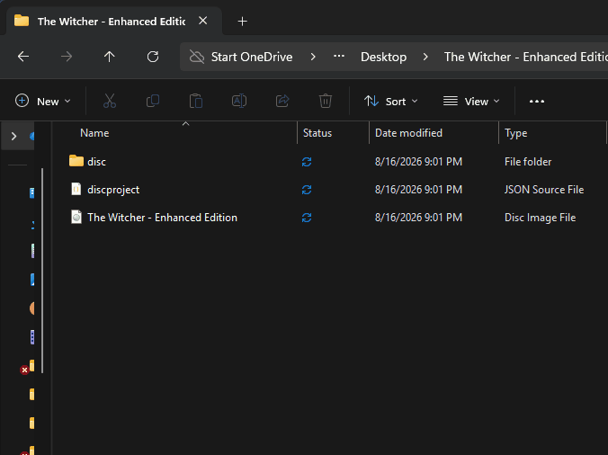
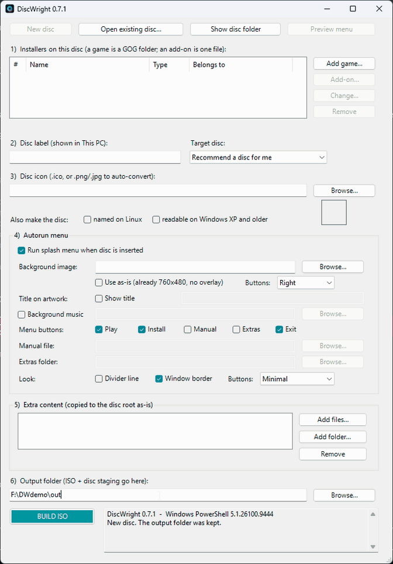
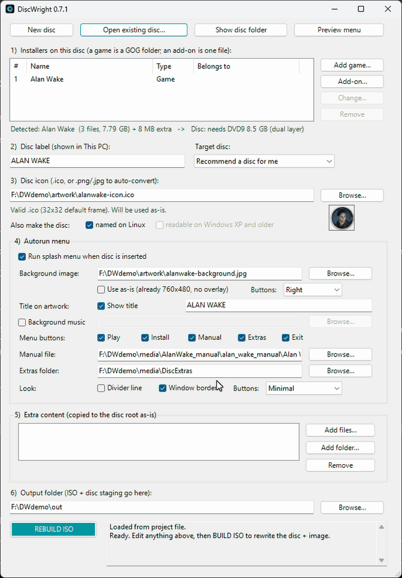

# DiscWright

Turn a GOG offline installer into a real game disc — one that shows the game's own icon and title in This PC, and opens a menu when you double-click it.

The way PC games came in a box.



## Why

GOG sells DRM-free installers. You own them outright, you can back them up, and nothing phones home. But they sit in a folder called `setup_alan_wake_1.1_music_lang_fix_(80728).exe` and that is not quite the same as a shelf.

Burn one with any normal ISO tool and Windows shows you `DVD RW Drive (E:)`. Burn one with DiscWright and Windows shows you the game.

Insert the disc and you get:

- **The game's icon** in This PC, not a generic disc
- **The game's name** as the drive label
- **A menu** on double-click — Play, Install, Game Manual, Extras, Exit
- **Music**, if you want it

Play knows whether the game is already installed and greys itself out until it is. Install runs the GOG installer straight off the disc. Extras opens whatever you put there — manuals, soundtracks, wallpapers, the making-of video.

**A disc can hold more than one game.** With two or more, the menu opens on a chooser and picking one leads to its own screen, with Back to return. DLC, an expansion, a GOG patch or a mod goes on the game it belongs to, where it becomes an extra Install button on that game's screen rather than another entry in the chooser. A one-game disc shows neither the chooser nor Back — it has nothing to choose.

## What you need

- **Windows 10 or 11**
- **Windows PowerShell 5.1** — the one that ships with Windows. DiscWright checks on startup and tells you if you launch it the wrong way. PowerShell 7 is refused: it may well work now that the ISO builder no longer needs a compiler option PowerShell 6 removed, but nobody has tried it, so the check stays until somebody does.
- **A blank disc and something to burn it with.** DiscWright makes the ISO. Burning is deliberately out of scope — [ImgBurn](https://www.imgburn.com/), Nero, and Windows' own built-in burner all do it well, and there is no reason to write a worse one.

No installation. No dependencies. It is a single PowerShell script.

## Download and run

There is nothing to install. DiscWright is a folder of scripts that runs from wherever you put it.

1. **Download it.** [Releases](../../releases) for a fixed version, or **Code → Download ZIP** for the latest.
2. **Unblock the ZIP *before* extracting.** Right-click it → **Properties** → tick **Unblock** → OK. Windows tags everything that came from the internet, and its built-in extractor copies that tag onto every file inside. Clearing it on the ZIP clears the whole folder in one go; skip this and you get a security prompt on every launch, and some setups will refuse to run the script at all.
3. **Extract it anywhere.** Desktop, Documents, a USB stick. The launchers use relative paths, so there is no fixed install location and nothing to add to PATH.
4. **Double-click `Run DiscWright.cmd`.**

`DiscWright.vbs` starts the same app with the console window hidden, if you would rather not have a black box flash up first. Try `Run DiscWright.cmd` to begin with — if something goes wrong, it is the one that shows you the error.

Want it on the Desktop or Start menu? Right-click `DiscWright.vbs` → **Show more options → Send to → Desktop (create shortcut)**, then set its icon to `DiscWright.ico` via the shortcut's Properties. Shortcuts are not shipped in the repo because they store an absolute path and would point at someone else's folder.

### What Windows is going to say

**"Windows protected your PC."** That is SmartScreen, on the first run of an unsigned launcher that came from the internet — **More info → Run anyway**. Treat that prompt as a reason to go read the code, not as a formality to click through.

**Your antivirus may take an interest.** A PowerShell script that compiles a helper class and writes a multi-gigabyte ISO looks unusual to heuristics.

The launchers run the script with `-ExecutionPolicy Bypass`, the flag Windows requires for any unsigned `.ps1`. You should be suspicious of anything that asks you to do that, so: the entire tool is one readable script in this repo. Read it before you run it. That is the point of shipping source instead of an `.exe` — a compiled binary would hide the code *and* trip more antivirus, and it would still be unsigned.

## Making a disc



1. **Add the games** — each one a GOG folder holding `setup_*.exe` and any `.bin` parts. DiscWright reads the game's name out of the installer and tells you which disc size the lot of them needs. Add as many as fit.

   **Add-ons** — DLC, expansions, GOG patches, mods — are added the same way, except you pick the **installer file** rather than a folder, and it can be **any `.exe`**: the `setup_*.exe` rule is how a GOG *game* folder is recognised, and GOG ships patches as `patch_*.exe` while a mod installer is named whatever its author chose. You say which game each one belongs to. Names come from the filename and can be edited, because every GOG patch reports the game's own name as its product name — all four Hollow Knight patches call themselves "Hollow Knight".
2. **Set the disc label** — what This PC will call the drive. **Target disc** next
   to it is where you say which blank you are going to burn, so DiscWright can tell
   you whether it fits; leave it on *Recommend a disc for me* and it picks a size
   instead.
3. **Choose an icon** — a `.ico`, or any PNG/JPG and it builds a proper multi-size icon for you.
4. **Set up the menu** — background artwork, which side the buttons sit on, which buttons you want, optional music, optional title text over the artwork.
5. **Add extra content** — a manual, an Extras folder, or any loose files and folders to drop at the disc root. Each game can also have a manual and an Extras folder **of its own**, set when you add it; a game with none of its own falls back to the disc-wide ones.
6. **Pick an output folder** and hit BUILD ISO.

**Preview menu** renders the menu with your current settings without building anything, so you can nudge the layout without waiting on a rebuild.

**Test it before you burn.** Right-click the finished `.iso` and choose **Mount**. Windows gives you a virtual drive carrying the real icon, the real label and the real menu — exactly what the burned disc will do, at no cost in discs. That is what the animation at the top of this page is showing.

Every build writes a `discproject.json` next to the ISO. **Open existing disc...** loads it back so you can change one thing and rebuild, months later.

**New disc** clears the form and starts over without restarting the app — useful when you are making several discs in one sitting. It asks first, and it keeps the output folder, since that is the one field you would otherwise retype every time.

### More than one game on a disc



Two games and two Hollow Knight patches, ending on the menu the disc will show.

The patches sit on Hollow Knight's own screen rather than in the chooser, and they stay **greyed until that game is installed** — applying a patch to nothing produces an error from GOG's installer several clicks later, which is a poor place to learn the rule.

### When it does not fit on one disc

Pick the disc you are going to burn from **Target disc** in step 2 and the line under
the installer list says whether it fits: *fits DVD5 4.7 GB*, or *1.17 GB too big for a
DVD9 8.5 GB*. The dropdown annotates every row the same way, so you can see at a glance
which blank you need.

If it does not fit, remove an entry or pick a larger disc. **DiscWright will not split
the list across several discs for you.** It used to, and that was a mistake: it packed
in whatever order the rows happened to sit in, which made a curation decision — which
games belong together on a disc — that is yours to make, and labelled the results `D1`
and `D2` as though one continued the other when neither ever needed the other.

To make a second disc, reopen the project, swap the games and rebuild. The icon,
background, music and buttons all carry over, so only the list and the label change.

**A single game bigger than the disc is refused by name.** Spreading one game's `.bin`
parts across several discs was tested and deliberately not built — see the
[roadmap](ROADMAP.md) under *Not planned*.

## What ends up on the disc

One game, and the installer sits at the root:

```
E:\
├─ autorun.inf              drive icon, drive label, menu launcher
├─ HollowKnight.ico         named after the disc, not "disc.ico" (see below)
├─ setup_hollow_knight_....exe
├─ AUTORUN\
│   ├─ menu.hta             the menu itself
│   ├─ bg.png               composed background
│   ├─ music.mp3            optional
│   └─ HollowKnight.ico
└─ Extras\                  manual, bonus content, whatever you added
```

Two or more, and every entry moves into a numbered folder of its own:

```
E:\
├─ autorun.inf
├─ MetroidvaniaNight.ico
├─ AUTORUN\                 as above
├─ Games\
│   ├─ 01 - Hollow Knight\
│   │   ├─ setup_hollow_knight_....exe
│   │   └─ Extras\          this game's own manual and bonus content
│   ├─ 02 - Ori and the Blind Forest\
│   │   └─ setup_ori_....exe
│   └─ 03 - Hollow Knight 1.5 patch\
│       └─ patch_hollow_knight_....exe
└─ Extras\                  the disc-wide ones, for games with none of their own
```

An add-on gets its own numbered folder like anything else — its `.bin` parts are named after its own installer, and a flat root holding a dozen setup files is unreadable. Where it belongs is a question for the *menu*, not for the disc layout: entry 03 above appears as a second Install button on Hollow Knight's screen and not in the chooser.

The numbering is what makes the disc browsable by hand: it puts the folders in the same order as the menu. Names are folded to plain ASCII for the same reason the disc label is — a disc that is legible in every file manager is worth more than an exact title.

The icon is named after the disc rather than a fixed `disc.ico` for a specific reason: Explorer caches icons **by file path**, so `E:\disc.ico` is the same cache key for every disc that ever passes through that drive letter. Swap discs and Explorer will happily redraw the previous game's icon. Naming it after the disc gives each one its own key.

## Burning the ISO

DiscWright does not burn. But two things are worth knowing, because both cost real discs to learn.

**Burn slower than the maximum.** A disc rated 6× does not mean your setup can feed it at 6×. An external USB burner behind a USB 2.0 link has roughly 30 MB/s to work with, and 6× Blu-ray wants 27 MB/s of that, with a 4 MB buffer absorbing any hiccup. Dropping to 4× halves the demand and costs a few extra minutes. On a 25 GB BD-R, 6× failed 7.4 GB in with a write error; 4× wrote the whole 9.2 GB without complaint.

**Check the link, not the label.** A USB 3.0 drive in a USB 3.0 port with a USB 3.0 cable can still negotiate a USB 2.0 link, and nothing in Windows will tell you unless you go looking. Your burning software's log usually names the bus it actually got.

## Known limitations

Stated up front rather than discovered later.

- **`mshta.exe` must be available.** The menu is an HTA. It ships with Windows 11, but a lot of hardened and enterprise environments disable it. The disc icon and label still work; only the menu is affected.
- **AutoPlay has to be allowed.** If you have previously told Windows to "Take no action" for this drive, the menu will not launch on insert. Double-clicking the drive still opens it.
- **Paths longer than 260 characters** will fail during the copy. PowerShell 5.1 limitation.
- **One music track** per disc, by design. Manuals are per game.
- **One game bigger than one disc cannot be split.** Several games are packed across a
  set happily, but a single installer larger than the disc you picked is refused by
  name. Spreading one game's `.bin` parts across a set was tested and deliberately not
  built: the installer asks for parts out of order, a different number of times each run,
  and keeps going back to discs it has already read — which is not the disc swap it looks
  like. The [roadmap](ROADMAP.md) records the evidence under *Not planned*. Use a larger
  blank instead.
- **Disc labels are limited to what Windows can encode.** AutoRun reads `autorun.inf` in the system ANSI codepage and has no Unicode mode at all, so accented Latin characters are fine but Cyrillic, Greek and CJK are not. DiscWright shows you exactly what This PC will display and asks before building one it cannot represent.

Not all of these are permanent — the [roadmap](ROADMAP.md) says which are being worked on and which are settled. [Issues](../../issues) is the place to ask for something, and [CHANGELOG.md](CHANGELOG.md) records what has changed between releases.

## Media sizes

| Payload | Disc |
|---|---|
| up to 0.68 GB | CD-R 700 MB |
| up to 4.37 GB | DVD5 4.7 GB |
| up to 7.95 GB | DVD9 8.5 GB dual layer |
| up to 23.3 GB | BD-R 25 GB |
| up to 46.6 GB | BD-R DL 50 GB |
| up to 93 GB | BD-R XL 100 GB |

## License

MIT. See [LICENSE](LICENSE).

## Not affiliated with GOG

DiscWright is an independent hobby project. It is **not affiliated with, endorsed by, or connected to GOG.com, GOG sp. z o.o., or CD PROJEKT**. "GOG" is their trademark and is used here only to describe what the tool reads.

It works with GOG offline installers because those installers are DRM-free by design — that is GOG's whole proposition, and it is the only reason a tool like this can exist. DiscWright circumvents nothing. Use it with games you own, to make copies for yourself.
