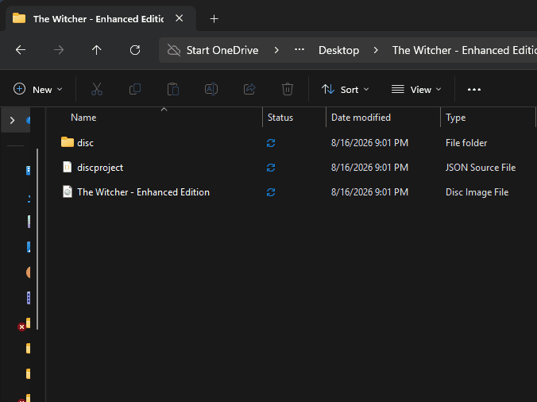
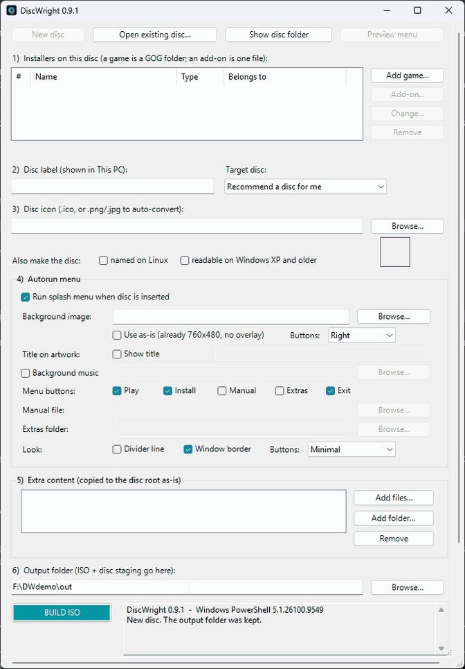
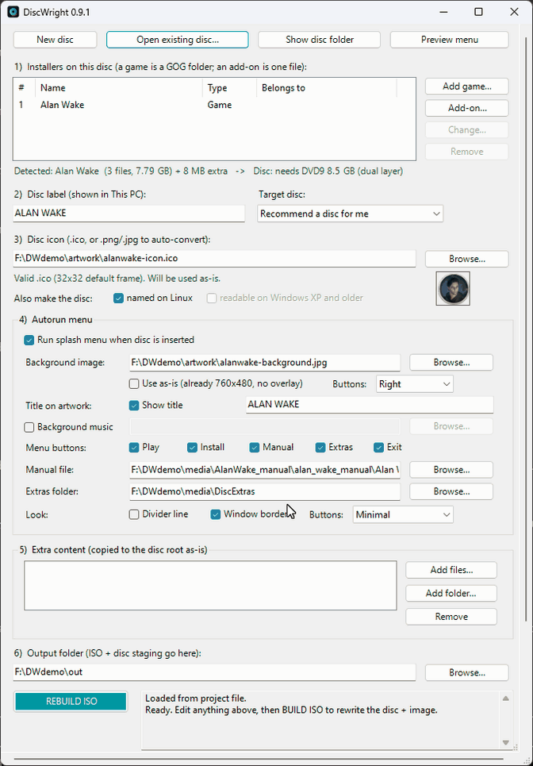
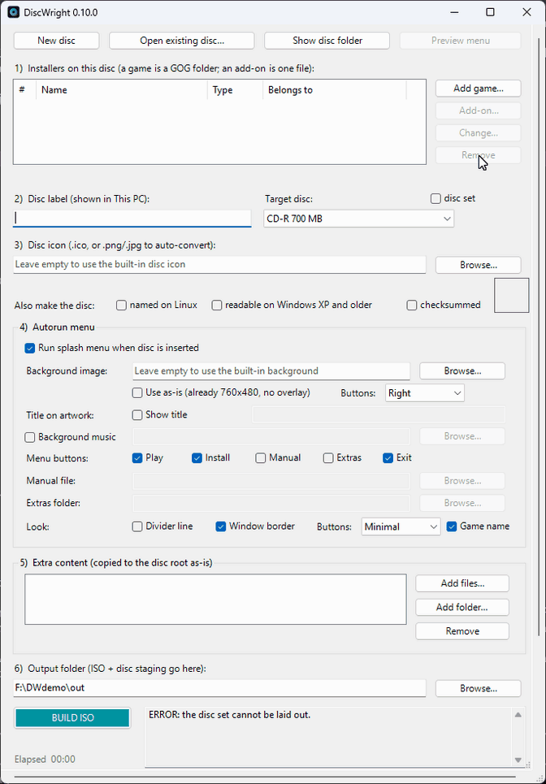
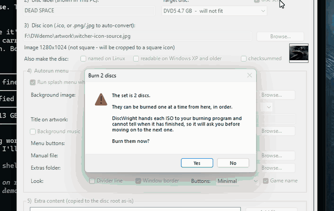
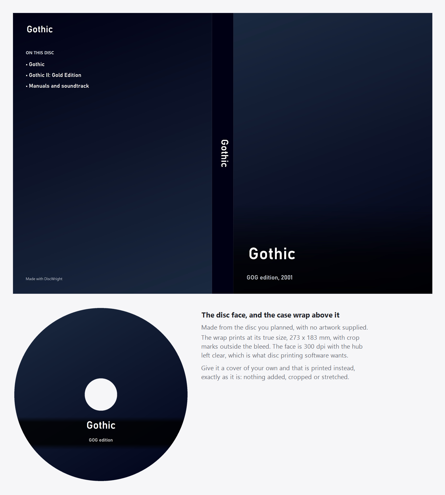

# DiscWright

Turn a GOG offline installer into a real game disc — one that shows the game's own icon and title in This PC, and opens a menu when you double-click it. DiscWright builds the image, prints the cover and the disc face, burns the disc and then checks every file on it.

The way PC games came in a box.



## Why

GOG sells DRM-free installers. You own them outright, you can back them up, and nothing phones home. But they sit in a folder called `setup_alan_wake_1.1_music_lang_fix_(80728).exe` and that is not quite the same as a shelf.

Burn one with any normal ISO tool and Windows shows you `DVD RW Drive (E:)`. Burn one with DiscWright and Windows shows you the game.

Insert the disc and you get:

- **The game's icon** in This PC, not a generic disc
- **The game's name** as the drive label
- **A menu** on double-click — Play, Install, Game Manual, Extras, Exit
- **Music**, if you want it

Play knows whether the game is already installed and greys itself out until it is. Install runs the GOG installer straight off the disc. Extras opens whatever you put there — manuals, soundtracks, wallpapers, the making-of video.

**A disc can hold more than one game.** With two or more, the menu opens on a chooser and picking one leads to its own screen, with Back to return. DLC, an expansion, a GOG patch or a mod goes on the game it belongs to, where it becomes an extra Install button on that game's screen rather than another entry in the chooser. A one-game disc shows neither the chooser nor Back — it has nothing to choose.

**A game does not have to come from GOG.** Point DiscWright at any folder of game files — an installed game, an unpacked archive, an itch.io download, anything portable — and it goes on the disc as it stands, subfolders and all. DiscWright asks whether one of the executables in there is an installer: say which and the menu gets an Install button for it, or say there is none and the menu gets **Open Folder** instead, which opens the game's folder on the disc.

## What you need

- **Windows 10 or 11**
- **Windows PowerShell 5.1** — the one that ships with Windows. DiscWright checks on startup and tells you if you launch it the wrong way. PowerShell 7 is refused: it may well work now that the ISO builder no longer needs a compiler option PowerShell 6 removed, but nobody has tried it, so the check stays until somebody does.
- **A blank disc and a burner**, if you want a disc rather than an image. DiscWright burns it for you and checks the result, and any other burning tool works just as well on the ISO it writes.
- **A printer**, only if you want the cover and the disc face. Everything else works without one.

No installation. No dependencies. It is a single PowerShell script.

## Download and run

There is nothing to install. DiscWright is a folder of scripts that runs from wherever you put it.

[**discwright.com**](https://discwright.com) is the same thing with pictures, if you would rather send someone a page than a repo.

1. **Download it.** [Releases](../../releases) for a fixed version, or **Code → Download ZIP** for the latest.
2. **Unblock the ZIP *before* extracting.** Right-click it → **Properties** → tick **Unblock** → OK. Windows tags everything that came from the internet, and its built-in extractor copies that tag onto every file inside. Clearing it on the ZIP clears the whole folder in one go; skip this and you get a security prompt on every launch, and some setups will refuse to run the script at all.
3. **Extract it anywhere.** Desktop, Documents, a USB stick. The launchers use relative paths, so there is no fixed install location and nothing to add to PATH.
4. **Double-click `Run DiscWright.cmd`.**

**There is an installer on the releases page, and on a current Windows 11 it may not run.** The installer is not code signed, and Smart App Control blocks unsigned programs with "An Application Control policy has blocked this file". It is on by default after a clean install of Windows 11 22H2 or later, in North America and Europe, and starts in an evaluation mode that blocks nothing before switching itself on. A machine upgraded from an older Windows has it off. Measured rather than assumed: the installer check passed in a Windows Sandbox on 27 September while Smart App Control there was still evaluating, and was blocked on 1 October once it had switched on.

**The ZIP above is unaffected and is the download to use.** It is a folder of PowerShell scripts, started by `Run DiscWright.cmd` through the copy of PowerShell that ships with Windows, and there is no unsigned program in that chain for Smart App Control to object to.

If you want the installer on a machine that blocks it, [Microsoft's documentation](https://learn.microsoft.com/en-us/windows/apps/develop/smart-app-control/overview) explains the setting, which lives under **Windows Security → App & browser control → Smart App Control**. Signing would fix it properly, since Smart App Control allows anything signed by a certificate from a CA in the Trusted Root Program even with no reputation behind it, and that is a cost this project has not taken on.

`DiscWright.vbs` starts the same app with the console window hidden, if you would rather not have a black box flash up first. Try `Run DiscWright.cmd` to begin with — if something goes wrong, it is the one that shows you the error.

Want it on the Desktop or Start menu? Right-click `DiscWright.vbs` → **Show more options → Send to → Desktop (create shortcut)**, then set its icon to `DiscWright.ico` via the shortcut's Properties. Shortcuts are not shipped in the repo because they store an absolute path and would point at someone else's folder.

### What Windows is going to say

**"Windows protected your PC."** That is SmartScreen, on the first run of an unsigned launcher that came from the internet — **More info → Run anyway**. Treat that prompt as a reason to go read the code, not as a formality to click through.

**Your antivirus may take an interest.** A PowerShell script that compiles a helper class and writes a multi-gigabyte ISO looks unusual to heuristics.

The launchers run the script with `-ExecutionPolicy Bypass`, the flag Windows requires for any unsigned `.ps1`. You should be suspicious of anything that asks you to do that, so: the entire tool is one readable script in this repo. Read it before you run it. That is the point of shipping source instead of an `.exe` — a compiled binary would hide the code *and* trip more antivirus, and it would still be unsigned.

## Making a disc



1. **Add the games** — each one a GOG folder holding `setup_*.exe` and any `.bin` parts. DiscWright reads the game's name out of the installer and tells you which disc size the lot of them needs. Add as many as fit.

   **A folder that is not a GOG download** is taken too. DiscWright says so and asks what the menu should do with it: it lists every executable it found, biggest first, so you can name the one that installs the game — or leave it on *No installer*, which puts the files on the disc and gives the menu an **Open Folder** button. Either way the whole folder goes on the disc with its subfolders intact, and the entry is named after the folder, or after the installer you named if that reports a product name. An empty folder is still refused.

   Two things worth knowing about a folder like that, neither of which can happen to a GOG download, whose files are only ever `setup_*.exe` and `.bin` parts. **A file of its own called `autorun.inf`, or named like the disc's icon, is replaced by the disc's** when that game is the only one on the disc, because those files live at the disc root and the disc's own have to win: its `autorun.inf` is what opens the menu. The log says which files that happened to. And **a name longer than 103 characters** goes on a disc built here, because this writes UDF, but [the Linux version](https://github.com/lazardjokovic/discwright-linux) refuses it: that one writes Joliet, where such a name arrives cut.

   **Add-ons** — DLC, expansions, GOG patches, mods — are added the same way, except you pick the **installer file** rather than a folder, and it can be **any `.exe`**: the `setup_*.exe` rule is how a GOG *game* folder is recognised, and GOG ships patches as `patch_*.exe` while a mod installer is named whatever its author chose. You say which game each one belongs to. Names come from the filename and can be edited, because every GOG patch reports the game's own name as its product name — all four Hollow Knight patches call themselves "Hollow Knight".
2. **Set the disc label** — what This PC will call the drive. **Target disc** next
   to it is where you say which blank you are going to burn, so DiscWright can tell
   you whether it fits; leave it on *Recommend a disc for me* and it picks a size
   instead.
3. **Choose an icon** — a `.ico`, or any PNG/JPG and it builds a proper multi-size icon for you.
4. **Set up the menu** — background artwork, which side the buttons sit on, which buttons you want, optional music, optional title text over the artwork.
5. **Add extra content** — a manual, an Extras folder, or any loose files and folders to drop at the disc root. Each game can also have a manual and an Extras folder **of its own**, set when you add it; a game with none of its own falls back to the disc-wide ones.
6. **Pick an output folder** and hit BUILD ISO.

**Preview menu** renders the menu with your current settings without building anything, so you can nudge the layout without waiting on a rebuild.

**Test it before you burn.** Right-click the finished `.iso` and choose **Mount**. Windows gives you a virtual drive carrying the real icon, the real label and the real menu — exactly what the burned disc will do, at no cost in discs. That is what the animation at the top of this page is showing.

Every build writes a `discproject.json` next to the ISO. **Open existing disc...** loads it back so you can change one thing and rebuild, months later.

**New disc** clears the form and starts over without restarting the app — useful when you are making several discs in one sitting. It asks first, and it keeps the output folder, since that is the one field you would otherwise retype every time.

### More than one game on a disc



Two games and two Hollow Knight patches, ending on the menu the disc will show.

The patches sit on Hollow Knight's own screen rather than in the chooser, and they stay **greyed until that game is installed** — applying a patch to nothing produces an error from GOG's installer several clicks later, which is a poor place to learn the rule.

### When it does not fit on one disc

Pick the disc you are going to burn from **Target disc** in step 2 and the line under
the installer list says whether it fits: *fits DVD5 4.7 GB*, or *1.17 GB too big for a
DVD9 8.5 GB*. The dropdown annotates every row the same way, so you can see at a glance
which blank you need.

If one game does not fit, DiscWright offers to write it as a **disc set**: as many
discs as it takes, each carrying a list of the whole set, and a menu on every one of
them that copies the discs back into a single folder and installs from there. Nothing
is ever installed from a disc, which is what makes it work. See *A game across several
discs* below.

Several games are a different question, and the answer there is still no. **DiscWright
will not pack a list of games across discs for you.** It used to, and that was a
mistake: it packed in whatever order the rows happened to sit in, which made a curation
decision, which games belong together on a disc, that is yours to make, and labelled the
results `D1` and `D2` as though one continued the other when neither ever needed the
other. A set holds one game.

To make a second disc, reopen the project, swap the games and rebuild. The icon,
background, music and buttons all carry over, so only the list and the label change.

**A single game bigger than the disc is refused by name.** Spreading one game's `.bin`
parts across several discs was tested and deliberately not built — see the
[roadmap](ROADMAP.md) under *Not planned*.

### A game across several discs

A GOG download can run to 14 GB and a DVD holds 4.7. When the game you added will not
fit the blank you chose, DiscWright works out whether splitting it would help and asks:

> This disc comes to 8.13 GB and a DVD5 4.7 GB holds 4.37 GB. It can be written as a set
> of 2 discs instead. Write 2 discs?

Saying yes ticks the **disc set** box, so the form shows what is about to happen and the
project remembers it. You can tick it yourself beforehand instead.

With the box ticked, the line under the installer list stops weighing the game against
one disc and says what the set comes to instead, so changing the target shows the cost
before anything is written:

| Target disc | What the line says |
| --- | --- |
| DVD5 4.7 GB | 3 discs of DVD5 4.7 GB |
| DVD9 8.5 GB | 2 discs of DVD9 8.5 GB |
| BD-R 25 GB | fits one BD-R 25 GB, so no set is needed |
| CD-R 700 MB | one file is 4.00 GB, so a set needs a DVD5 4.7 GB (3 discs) |

That last one is the whole rule in a line. A set splits a game between discs, but it
never splits a file, so a disc smaller than the biggest file cannot hold the set however
many of them you have.

It writes one ISO per disc, then offers to burn them one at a time, in order, handing
each to whichever program you use. It asks you between discs rather than claiming to
know when a burn has finished, because it hands the ISO over and gets nothing back.



Every disc carries `Disc set.txt`, which lists every file in the **whole** set with its
disc number, size and SHA-256, and a few lines of PowerShell that check a folder by hand
on a machine that has never heard of DiscWright.

Put any disc of the set in and its menu offers no Play and no Install, because neither
can work yet. It says which disc it is, proposes a folder on the drive with the most
room, and the button says **Copy disc 1 of 2**. After copying it says what to do next:
*2 of 4 files copied so far. Now put disc 2 in.*



When every file is present and the right size, **Install** appears and runs the
installer from that folder. For a folder of game files it says **Play**, and **Open
Folder** when nothing in it was picked to run. Afterwards it will delete the copies, and
it removes only the files `Disc set.txt` names, so anything else in that folder is left
alone.

Whole files only. A single file larger than one disc is refused by name rather than cut
in two: a join has to be byte perfect, the pieces look like broken files to anybody
browsing the disc, and it is a new way to lose a game.

A set holds one game. Which games belong together on a disc is a decision for the person
making it.

## What ends up on the disc

One game, and the installer sits at the root:

```
E:\
├─ autorun.inf              drive icon, drive label, menu launcher
├─ Start Here.hta           opens the menu when AutoPlay does not
├─ HollowKnight.ico         named after the disc, not "disc.ico" (see below)
├─ setup_hollow_knight_....exe
├─ AUTORUN\
│   ├─ menu.hta             the menu itself
│   ├─ bg.png               composed background
│   ├─ music.mp3            optional
│   └─ HollowKnight.ico
└─ Extras\                  manual, bonus content, whatever you added
```

**`Start Here.hta` is there because AutoPlay often is not.** It is switched off on a great many machines, and on those a disc looks like a folder of installers with no obvious way in, since the menu sits one level down in `AUTORUN` where nobody browsing a disc would think to open it. Double-clicking `Start Here.hta` opens the menu. It starts the real menu rather than being a second copy of it, and it needs nothing the disc did not already need.

Two or more, and every entry moves into a numbered folder of its own:

```
E:\
├─ autorun.inf
├─ Start Here.hta
├─ MetroidvaniaNight.ico
├─ AUTORUN\                 as above
├─ Games\
│   ├─ 01 - Hollow Knight\
│   │   ├─ setup_hollow_knight_....exe
│   │   └─ Extras\          this game's own manual and bonus content
│   ├─ 02 - Ori and the Blind Forest\
│   │   └─ setup_ori_....exe
│   └─ 03 - Hollow Knight 1.5 patch\
│       └─ patch_hollow_knight_....exe
└─ Extras\                  the disc-wide ones, for games with none of their own
```

An add-on gets its own numbered folder like anything else — its `.bin` parts are named after its own installer, and a flat root holding a dozen setup files is unreadable. Where it belongs is a question for the *menu*, not for the disc layout: entry 03 above appears as a second Install button on Hollow Knight's screen and not in the chooser.

The numbering is what makes the disc browsable by hand: it puts the folders in the same order as the menu. Names are folded to plain ASCII for the same reason the disc label is — a disc that is legible in every file manager is worth more than an exact title.

The icon is named after the disc rather than a fixed `disc.ico` for a specific reason: Explorer caches icons **by file path**, so `E:\disc.ico` is the same cache key for every disc that ever passes through that drive letter. Swap discs and Explorer will happily redraw the previous game's icon. Naming it after the disc gives each one its own key.

### The disc on Windows XP and older

DiscWright writes the ISO as UDF 2.50. Windows Vista was the first version that could read that, so **Windows XP, 2000, ME, 98 and 95 cannot mount one of these discs at all** — not a missing menu, the whole disc is unreadable there.

The second checkbox on the **Extra compatibility** row, **Readable on Windows XP and older**, fixes that by writing ISO9660 and Joliet filesystems alongside the UDF one. Every system reads the newest one it understands and ignores the rest, so a disc built with it ticked behaves on Windows 11 exactly as one built without it. It is off by default, and it costs nothing measurable on the disc.

**A game that came in parts cannot have it, and the box greys itself when yours cannot.** The older filesystems take a single file of 2 GiB at most. That number is measured against the Windows image writer that builds the disc, not read off the ISO9660 specification, which is twice as generous on paper and was what this said until a build failed on it. GOG splits its installers into parts just under 4 GiB, to stay under the identical FAT32 ceiling, so a game that arrives in parts is over this limit and the box is unavailable for it. A game that arrives as one installer under 2 GiB can have it, as can a disc of small things.

The filename limit turned out not to matter. Joliet holds names to 64 characters, but IMAPI writes long names into the ISO9660 tree regardless, and a real 96-character GOG patch filename survives intact.

## Proving a disc is still what you burned

The third checkbox on that row, **Checksummed**, writes `checksums.sha256` at the disc root: one line per file, with the SHA-256 of everything else the disc carries. It is there so a copy taken off the disc years from now can be proved identical to what went on it, which is the part a disc cannot tell you by itself.

It is written in the format `sha256sum` uses, so **nothing from DiscWright is needed to check it**, which rather matters for a file whose whole job is to still be useful in twenty years. On any Linux or macOS machine, and on Windows with Git or WSL installed:

```
sha256sum -c checksums.sha256
```

and on a bare Windows machine with nothing installed at all, the file prints a short PowerShell loop in its own header that does the same thing. A file that changed by a single byte comes back as `FAIL`.

It covers the menu and the icon as well as the games, so a disc verifies whole, and a game restored out of it still has its own lines to check against. **It is off by default**, like the other two, because what every disc carries is not a decision to make on somebody's behalf. The cost is one pass over the data: a few seconds for a CD, around twenty for a full DVD, and a few minutes for a Blu-ray filled to the brim.


If something added in step 5 slips past the greyed box, the build checks the finished disc folder again and falls back to UDF alone, saying so in the log, rather than writing an image that has lost a file.

Old DVD players and other appliances that only speak ISO9660 benefit from the same box.

**Reading the disc is not the same as installing from it.** Joliet long filenames go back to Windows 95, and plain ISO9660 further still, so the disc itself is browsable a long way back. The games are not. Every GOG installer checked declares **Windows 2000** as its minimum in its own PE header, and Windows 9x refuses to load a program that asks for 5.0. So on Windows 98 and 95 one of these discs opens and reads correctly and nothing on it will install; XP and 2000 are the oldest versions where the disc is genuinely useful.

### The disc on a Linux machine

There is a checkbox under the icon, **Also name the disc for Linux**, and it is **off by default**. Tick it and the disc gains two more files:

```
├─ .xdg-volume-info         drive icon and label, for Linux
├─ HollowKnight.png         the same icon again, in a format Linux reads
```

Then the disc knows its own name and wears its own cover art on a Linux machine, the same as it does in This PC. Windows never looks at either file; Linux never looks at `autorun.inf`; each reads the one it understands and ignores the other, so a disc built with the box ticked behaves on Windows exactly as one built without it.

What does **not** happen there is the menu. Linux disabled autorun for removable media deliberately, and no desktop will run a program off a disc you inserted — so `menu.hta` sits on the disc unopened, and the games are installed from the folders by hand. The icon and the label are the half that carries over.

The image is written twice because it has to be. `gvfs` turns the `IconFile=` line into a file icon and hands it to GdkPixbuf, whose `.ico` support is meant for favicons rather than for the seven-frame icon Windows wants. Both come from the same source picture, so they cannot end up disagreeing about what the game looks like.

Untick it and rebuild and both files are removed again — leaving the info file behind would point Linux at an icon that is no longer on the disc.

None of this makes DiscWright run on Linux. It builds the ISO on Windows, as it always has; the box only changes what goes onto the disc.

### A patch for a machine the installer will not run on

Extra content is not only for manuals. A GOG installer will not run on Windows 98, as above — but an official patch from that era will, and a disc is the easiest way onto a machine that has no business being on the internet.

Put the patch in **step 5** and it lands at the disc root beside the installer, untouched. On XP the installer runs normally; on 98 it will not, and the period patch is right there to run or to keep. That also works for anything else the menu was never going to launch — a `.txt` of serials, a scanned manual, a mod archive.

A `patch_*.exe` can also be added as an **add-on entry**, which files it in the menu under the game it patches. That is the better place when the patch is for the same Windows the disc is aimed at. For something the menu could never launch anyway, step 5 is simpler.

## Burning the disc

**Burn to disc** writes the ISO to a blank and then proves it. It asks first, and
the question carries what is worth refusing on: which image, how large, which
drive, what disc is in it and how much of it is free. It refuses rather than
guesses when there is no disc, when the disc is not blank, or when the image is
larger than the space.

It burns below the drive's top speed, 16× on a CD and 8× on a DVD, because cheap
media written flat out is the usual way to make a coaster and the minute saved is
not worth a disc. The window stops responding while the drive writes, which the
dialog says beforehand along with roughly how long it will take: the drive writes
in one go and reports nothing until it finishes.

Afterwards it reads every file back off the disc and compares it with what was
built, by SHA-256. A burn that ends without an error is not the same thing as a
disc holding the right bytes, and that check is the reason to burn from here
rather than from a file manager.

Three things are still worth knowing, because all of them cost real discs to
learn.

**If you burn it yourself, burn the ISO, or the disc folder's *contents* — never the folder itself.** DiscWright writes the finished image beside a staging folder called `disc`:

```text
The Witcher\
├─ disc\                 the CONTENTS of this are what goes on the disc
│   ├─ autorun.inf
│   ├─ TheWitcher.ico
│   └─ AUTORUN\
└─ The Witcher.iso      burn this and the layout is already right
```

Burning the `disc` folder rather than what is inside it puts everything one level down, so the disc reads `E:\disc\autorun.inf` instead of `E:\autorun.inf`. **AutoRun only ever looks at the root**, so one level down it is an ordinary file nothing reads. The disc still opens, the menu still runs if you double-click it, and autorun is simply dead — on every version of Windows, which is what makes it confusing to diagnose.

Most burning software asks which you meant. The answer is the contents. Burning the `.iso` avoids the question entirely, and is the reason it is there.

**Burn slower than the maximum.** DiscWright already does; this matters when you burn the ISO with something else. A disc rated 6× does not mean your setup can feed it at 6×. An external USB burner behind a USB 2.0 link has roughly 30 MB/s to work with, and 6× Blu-ray wants 27 MB/s of that, with a 4 MB buffer absorbing any hiccup. Dropping to 4× halves the demand and costs a few extra minutes. On a 25 GB BD-R, 6× failed 7.4 GB in with a write error; 4× wrote the whole 9.2 GB without complaint.

**Check the link, not the label.** A USB 3.0 drive in a USB 3.0 port with a USB 3.0 cable can still negotiate a USB 2.0 link, and nothing in Windows will tell you unless you go looking. Your burning software's log usually names the bus it actually got.

## Printing the cover and the disc face



**Print artwork** makes two things for the disc you have planned: a case wrap, as
a PDF at its true size with crop marks, and a disc face, as a 300 dpi PNG with
the hub left clear. A PDF because the page carries its real physical size, so
"print at 100%, no scaling" is something the driver can honour. A PNG for the
disc because that is what printer software for printable discs wants: you hand it
a picture and it keeps the diameters and lines the tray up, which is the part
that ruins discs when a tool guesses at it.

**Artwork you already have is printed exactly as it is.** People make covers for
games and share them, and somebody who has found or drawn one does not want a
layout imposed on it. Point DiscWright at one and it places it at exact trim,
carries its own edges outwards to make the bleed it has not got, and puts crop
marks outside that. Nothing is added, nothing is cropped off, and nothing is
stretched. With no picture at all you get a plain label with the title on it,
which is still worth having on an unmarked disc in a stack.

Two boxes in step 7 hold the pictures, one for the cover and one for the disc
face, because a cover is tall and a disc face is a circle and one picture rarely
suits both. Under them a line says what each picture will cost before anything is
printed: a 16:9 wallpaper loses about 60% of its width on a cover panel, and
being told that beforehand beats finding out on paper.

DiscWright does not align anything to a printer tray. That belongs to the printer
software, it differs by printer, and getting it wrong wastes a disc.

## Known limitations

Stated up front rather than discovered later.

- **`mshta.exe` must be available.** The menu is an HTA. It ships with Windows 11, but a lot of hardened and enterprise environments disable it. The disc icon and label still work; only the menu is affected.
- **AutoPlay has to be allowed.** If you have previously told Windows to "Take no action" for this drive, the menu will not launch on insert. Double-clicking the drive still opens it.
- **Paths longer than 260 characters** will fail during the copy. PowerShell 5.1 limitation.
- **One music track** per disc, by design. Manuals are per game.
- **A single file bigger than the disc cannot be split.** One game across several discs
  is built: DiscWright offers it when the payload will not fit. But it places whole
  files, so a single file larger than the blank is refused by name, and the answer is a
  larger blank. GOG splits its own downloads just under 4 GiB, so on a DVD5 and up there
  is rarely anything to cut. Whether to build it is open, with the
  reasoning and what it would take, in the [roadmap](ROADMAP.md).
- **A game cannot be installed straight off a set of discs.** The discs are copied back
  into one folder first and the installer runs from there. Swapping discs while the
  installer asks was tested and deliberately not built: it asks for parts out of order, a
  different number of times each run, and keeps going back to discs it has already read.
  The [roadmap](ROADMAP.md) records the evidence.
- **Disc labels are limited to what Windows can encode.** AutoRun reads `autorun.inf` in the system ANSI codepage and has no Unicode mode at all, so accented Latin characters are fine but Cyrillic, Greek and CJK are not. DiscWright shows you exactly what This PC will display and asks before building one it cannot represent.

Not all of these are permanent — the [roadmap](ROADMAP.md) says which are being worked on and which are settled. [Issues](../../issues) is the place to ask for something, and [CHANGELOG.md](CHANGELOG.md) records what has changed between releases.

## Media sizes

| Payload | Disc |
|---|---|
| up to 0.68 GB | CD-R 700 MB |
| up to 4.37 GB | DVD5 4.7 GB |
| up to 7.95 GB | DVD9 8.5 GB dual layer |
| up to 23.3 GB | BD-R 25 GB |
| up to 46.6 GB | BD-R DL 50 GB |
| up to 93 GB | BD-R XL 100 GB |

## License

MIT. See [LICENSE](LICENSE).

## Not affiliated with GOG

DiscWright is an independent hobby project. It is **not affiliated with, endorsed by, or connected to GOG.com, GOG sp. z o.o., or CD PROJEKT**. "GOG" is their trademark and is used here only to describe what the tool reads.

It works with GOG offline installers because those installers are DRM-free by design — that is GOG's whole proposition, and it is the only reason a tool like this can exist. DiscWright circumvents nothing. Use it with games you own, to make copies for yourself.

Game names, logos and artwork shown in this README are the property of their respective owners, and appear only to demonstrate what the tool does.
